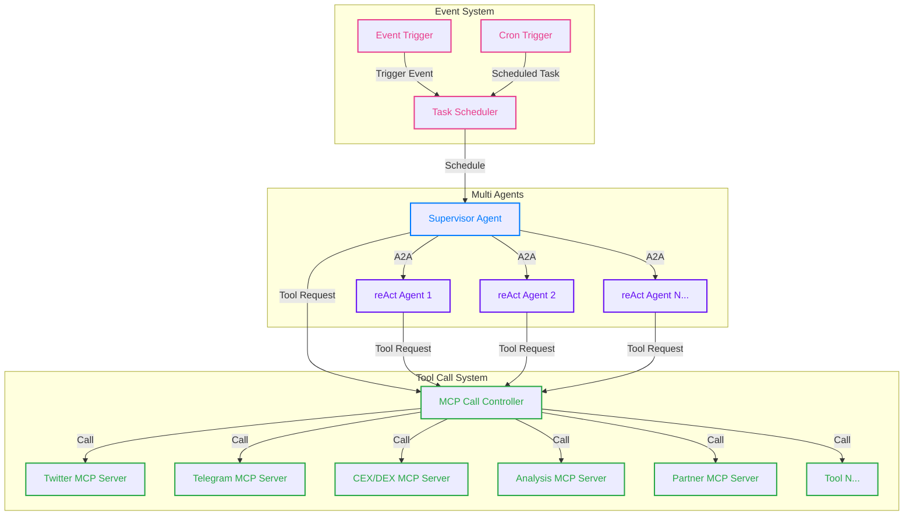

# 0xAuto OS: Automate Your AI Strategies, Powered by MCP and A2A!

Still managing Web3 manually? Too much information to process? Missing opportunities?

Say goodbye to tedious tasks and embrace intelligence! Introducing 0xAuto OS!

## What is 0xAuto OS?

Simply put, 0xAuto OS is an AI-powered operating system designed specifically for the Web3 world. Imagine having a team of AI-driven, 24/7 intelligent assistants (we call them Agents) at your disposal. These Agents not only help you automatically acquire and process massive amounts of information but also execute various complex tasks on schedule according to your specifications, such as DEX trading, token issuance, market movement monitoring, and more—while you can completely free your hands!

This is all made possible by our unique technical architecture:

- **Intelligent Agents**: Customizable AI robots that serve as your automated executors in the Web3 world.
- **MCP (Model Context Protocol) & A2A (Agent2Agent Protocol)**: We use universal open protocols that enable your Agents to easily access external capabilities (data, models, APIs) and other Agents' capabilities, essentially giving them wings. Developers and project teams can easily connect and contribute to the ecosystem.
- **Multi-Agent System**: Multiple Agents working together to handle more complex tasks, multiplying their effectiveness.
- **Abstract Wallet**: A secure, programmable built-in wallet that allows your Agents to automatically execute on-chain transactions and asset management on your behalf, enabling truly automated quantitative investments.
- **Core Advantage: Scheduled Execution!** Set it once, and Agents automatically execute tasks according to schedule, without requiring conversation or manual initiation each time, completely eliminating repetitive labor.

## Technical Architecture

## What Pain Points Does 0xAuto OS Solve?

1. **Information overload?** Agents help you collect, filter, and summarize key information on schedule, generating your personalized intelligence reports.
2. **Tasks too complicated? No time?** Agents help automate repetitive tasks, such as daily investment, monitoring whale wallets, or automatic copy trading.
3. **Complex strategies? Don't know how to code?** No programming required—simply configure Agents to execute your trading strategies or automation workflows.
4. **Concerned about security?** Abstract wallet ensures asset security, making automated transactions worry-free.
5. **Tired of chatting with AI to use it?** Our Agents support scheduled tasks that run automatically once set up, without human intervention.

## Who Needs 0xAuto OS?

- **Web3 Investors**: Whether novice or veteran, use it to automatically obtain Alpha, execute trading strategies, and manage DeFi positions, saving time and effort to stay ahead.
- **Web3 Developers/Projects**: Based on our universal MCP and A2A protocols, easily provide Agent capabilities for your projects or services, or integrate your services into the 0xAuto ecosystem.
- **Anyone Seeking Automation in Web3**: 0xAuto OS can be useful in any scenario requiring scheduled information acquisition or automatic execution of on-chain or off-chain tasks.

## Why Choose 0xAuto OS? — Core Advantages, Simple and Powerful!

- **AI Automation, Passive Income**: Set up your Agents to work for you 24/7, monitoring markets, executing strategies, and capturing every potential profit.
- **Scheduled Execution, Complete Freedom**: Unique scheduled task functionality eliminates manual repetition, making AI truly your automated assistant.
- **No Code Required, User-Friendly**: Simple configuration interface allows even beginners to easily create and manage their own AI Agents.
- **Secure Transactions, Asset Protection**: Built-in abstract wallet safeguards your automated transactions.
- **Open Ecosystem, Unlimited Possibilities**: Universal protocol design attracts more developers and services to join, continuously enhancing Agent capabilities and expanding choices.
- **Multi-Agent Collaboration, Intelligence Upgrade**: Multiple Agents working together complete more complex tasks, unleashing the power of collective intelligence.
- **(Future) Assisted Agent Generation**: We're working to make creating Agents even simpler—in the future, you might only need to express your idea, and AI will help generate your Agent!

## 0xAuto OS — Start Your Web3 Intelligent Automation New Era!

Explore now and let AI accelerate your Web3 journey!