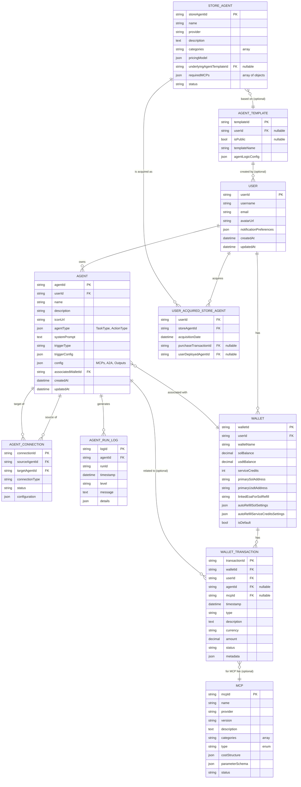

# 0xAuto OS - System Architecture

## 1. Introduction

This document outlines the comprehensive system architecture for the 0xAuto OS DApp. It integrates the functional and non-functional requirements, domain models, and pseudocode detailed in the various specification documents. The architecture prioritizes modularity, scalability, security, and testability, ensuring a robust platform for agent creation, management, and operation within the Solana ecosystem.

## 2. Architectural Goals

*   **Modularity:** Clearly defined components and services with distinct responsibilities.
*   **Scalability:** Ability to handle a growing number of users, agents, and transactions.
*   **Security:** Protection of user data, agent configurations, and wallet interactions.
*   **Testability:** Components and services designed for ease of unit, integration, and end-to-end testing.
*   **Extensibility:** Ability to easily add new features, agent types, MCPs, and store items.
*   **User Experience:** Support for the specified UI styling (Blue/White & Black/Purple themes, Glassmorphism, Flat Design, Apple-style, smooth lines, gradients) and a "Web3 feel" with animations/SVGs, as detailed in [`docs/00_ui_styling_guidelines.md`](docs/00_ui_styling_guidelines.md).

## 3. System Overview (High-Level)

The 0xAuto OS DApp follows a client-server architecture, comprising:

*   **Frontend Application:** A Next.js single-page application (SPA) providing the user interface for all DApp functionalities.
*   **Backend API Services:** A set of services handling business logic, data persistence, and interactions with the Solana blockchain and external systems (via MCPs).
*   **Database:** Stores persistent data related to users, agents, MCPs, wallets, and store items.
*   **File Storage:** Stores user-uploaded assets like agent icons and user avatars.
*   **Solana Blockchain:** Interacted with for on-chain operations like token transfers, smart contract interactions (via Agents/MCPs), and wallet management.
*   **MCP Hub/Services:** External or internal services integrated via the Model Context Protocol.

```mermaid
graph TD
    User[End User] --> Browser[Web Browser];
    Browser --> FE[Frontend Application (Next.js)];

    FE -- HTTPS/API Calls --> BE_Gateway[API Gateway];

    subgraph Backend_Services
        direction LR
        BE_Gateway --> UserService[User Service];
        BE_Gateway --> AgentService[Agent Service];
        BE_Gateway --> AgentExecutionService[Agent Execution Service];
        BE_Gateway --> WalletService[Wallet Service];
        BE_Gateway --> MCPService[MCP Management Service];
        BE_Gateway --> StoreService[Agent Store Service];
        BE_Gateway --> NotificationService[Notification Service];
        BE_Gateway --> FileUploadService[File Upload Service];
    end

    UserService --> DB[(Database)];
    AgentService --> DB;
    WalletService --> DB;
    MCPService --> DB;
    StoreService --> DB;
    NotificationService --> DB;

    AgentExecutionService -- Uses --> AgentService;
    AgentExecutionService -- Interacts --> Solana[Solana Blockchain];
    AgentExecutionService -- Interacts --> MCP_External[External MCP Services];
    WalletService -- Interacts --> Solana;
    FileUploadService -- Manages Files --> FS[File Storage];

    FE -- UI Styling --> StylingEngine[UI Styling Engine (CSS, Tailwind, ThemeProvider)];
    StylingEngine -- Adheres to --> UIDoc[[docs/00_ui_styling_guidelines.md]];

    classDef service fill:#D6EAF8,stroke:#3498DB,stroke-width:2px;
    classDef component fill:#E8F8F5,stroke:#1ABC9C,stroke-width:2px;
    classDef external fill:#FCF3CF,stroke:#F39C12,stroke-width:2px;
    classDef storage fill:#FADBD8,stroke:#E74C3C,stroke-width:2px;

    class FE,StylingEngine component;
    class BE_Gateway,UserService,AgentService,AgentExecutionService,WalletService,MCPService,StoreService,NotificationService,FileUploadService service;
    class DB,FS storage;
    class Solana,MCP_External external;
```

## 4. Frontend Architecture

The frontend application will be built using Next.js and React, leveraging TypeScript for type safety. State management will primarily use React Context API for global state (like user authentication, theme) and component-local state (`useState`, `useReducer`) for UI-specific logic. For server-state management (data fetching, caching, mutations), a library like React Query or SWR is recommended.

### 4.1. Key Pages and Components

The frontend will be structured around the main pages defined in the requirements:

*   **Dashboard (`src/app/(dashboard)/dashboard/page.tsx`):**
    *   Displays an overview of user's agents, recent activity, wallet balance, and quick actions.
    *   Components: `AgentOverviewCard`, `RecentActivityCard`, `QuickActionsCard`, `WalletBalanceCard`, `WatchedFeedsSection`.
    *   References: [`docs/01_dashboard_requirements.md`](docs/01_dashboard_requirements.md), [`docs/03_dashboard_pseudocode.md`](docs/03_dashboard_pseudocode.md).
*   **My Agents (Agent Management - `src/app/(dashboard)/agents/page.tsx`):**
    *   Lists all user-owned agents with search, filter, and sort capabilities.
    *   Provides actions per agent (details, edit, pause/start, logs, delete).
    *   Components: `AgentListPage`, `AgentTable`, `AgentCard` (if a card view is also desired).
    *   References: [`docs/04_agent_management_requirements.md`](docs/04_agent_management_requirements.md), [`docs/06_agent_management_pseudocode.md`](docs/06_agent_management_pseudocode.md).
*   **Agent Detail Page (`src/app/(dashboard)/agents/[agentId]/page.tsx`):**
    *   Displays detailed information about a specific agent, including status, description, configuration overview (trigger, MCPs, A2A, output), and run logs.
    *   Includes tabs for "Settings", "Task" (formerly Trigger), and "A2A".
    *   Components: `AgentDetailPage`, `AgentSettingsForm` (for settings tab), `TaskManagementComponent`, `A2AConnectionsComponent`.
    *   References: [`docs/01_agent_requirements.md`](docs/01_agent_requirements.md), [`docs/04_agent_management_requirements.md`](docs/04_agent_management_requirements.md), [`docs/03_agent_pseudocode.md`](docs/03_agent_pseudocode.md), [`docs/06_agent_management_pseudocode.md`](docs/06_agent_management_pseudocode.md).
*   **Create/Edit Agent Page (`src/app/(dashboard)/agents/new/page.tsx` & `src/app/(dashboard)/agents/[agentId]/edit/page.tsx` - or a unified component):**
    *   A multi-step form or single long-form page for configuring agent properties: Basic Info, Trigger, Core Logic (Dependent MCPs, A2A), Output, Resources & Wallet.
    *   Components: `AgentConfigPage`, `MCPSelectionModal`, `MCPConfigModal`, `AgentSelectionModal`.
    *   References: [`docs/07_agent_config_requirements.md`](docs/07_agent_config_requirements.md), [`docs/09_agent_config_pseudocode.md`](docs/09_agent_config_pseudocode.md).
*   **MCP Hub (`src/app/(dashboard)/mcp-hub/page.tsx`):**
    *   Marketplace for discovering and selecting MCPs.
    *   Features search, filter, sort, and card-based display of MCPs.
    *   Components: `MCPHubPage`, `MCPCard`, `MCPDetailView` (modal or separate page).
    *   References: [`docs/10_mcp_hub_requirements.md`](docs/10_mcp_hub_requirements.md), [`docs/12_mcp_hub_pseudocode.md`](docs/12_mcp_hub_pseudocode.md).
*   **Wallet Management (`src/app/(dashboard)/wallet/page.tsx`):**
    *   Manages abstract wallet balances (SOL, USDT, Service Credits), auto-refill settings, and transaction history.
    *   Components: `WalletManagementPage`, `DepositSolModal`, `WithdrawSolModal`, `PurchaseCreditsModal`, `TransactionTable`.
    *   References: [`docs/13_wallet_management_requirements.md`](docs/13_wallet_management_requirements.md), [`docs/15_wallet_management_pseudocode.md`](docs/15_wallet_management_pseudocode.md).
*   **Agent Store (`src/app/(dashboard)/store/page.tsx`):**
    *   Marketplace for discovering, purchasing, and deploying pre-built agents.
    *   Features search, filter, sort, and card-based display.
    *   Components: `AgentStorePage`, `StoreAgentCard`, `PurchaseConfirmationModal`, `DeploymentOptionsModal`, `StoreAgentDetailView`.
    *   References: [`docs/16_agent_store_requirements.md`](docs/16_agent_store_requirements.md), [`docs/18_agent_store_pseudocode.md`](docs/18_agent_store_pseudocode.md).
*   **User Settings (`src/app/(dashboard)/setting/page.tsx`):**
    *   Allows users to update their profile (username, avatar).
    *   References: [`docs/03_agent_pseudocode.md`](docs/03_agent_pseudocode.md) (for User entity changes).

### 4.2. UI Styling and Theming

*   **Global Styles:** Defined in [`src/app/globals.css`](src/app/globals.css).
*   **Theming:** A theme provider (e.g., React Context based) will manage the Blue/White (light) and Black/Purple (dark) themes. Theme switching capability should be provided.
*   **Component Styling:** Tailwind CSS is preferred for utility-first styling. Custom CSS modules can be used for more complex component-specific styles.
*   **Visual Elements:**
    *   **Glassmorphism:** Applied to card backgrounds, sidebars, modals. Achieved via background blur, transparency, subtle borders, and shadows.
    *   **Flat Design:** Used for icons, buttons, general layout.
    *   **Apple-style:** Influence overall aesthetics, typography (San Francisco or similar sans-serif like Inter, Poppins), iconography (SF Symbols style), spacing, and smooth animations.
    *   **Rounded Corners & Smooth Lines:** Applied consistently to interactive elements and containers.
    *   **Gradients:** Subtle use in backgrounds, buttons, or decorative elements, adhering to theme colors.
    *   **Animations & SVGs:** Enhance UX with subtle hover effects, smooth transitions, modern loading animations, and micro-interactions. SVGs for icons and "Web3 feel" illustrations (abstract geometrics, network visuals).
*   **Accessibility:** Adherence to WCAG AA guidelines for color contrast and focus states.
*   **Layout Component (`src/components/Layout.tsx`):** A shared layout component will wrap pages, including the common header and navigation structure.

### 4.3. Component Diagram (Frontend Focus)

```mermaid
graph TD
    App[0xAuto OS Frontend (Next.js)] --> LayoutComp{Layout Component};
    LayoutComp --> Header[HeaderNav (Dashboard, My Agents, MCP Hub, Wallet, Store, Notifications, UserProfile)];
    LayoutComp --> PageContent[Current Page Content];

    PageContent --> DashboardPage[Dashboard Page];
    DashboardPage --> D_AgentOverview[Agent Overview Card];
    DashboardPage --> D_RecentActivity[Recent Activity Card];
    DashboardPage --> D_QuickActions[Quick Actions Card];
    DashboardPage --> D_WalletBalance[Wallet Balance Card];

    PageContent --> AgentListPage[Agent List Page];
    AgentListPage --> AgentTableComp[Agent Table];
    AgentListPage --> SearchFilterSort[Search/Filter/Sort Controls];

    PageContent --> AgentDetailPage[Agent Detail Page];
    AgentDetailPage --> Tabs[Tabs (Settings, Task, A2A)];
    Tabs -- Settings --> AgentSettingsFormComp[Agent Settings Form];
    Tabs -- Task --> TaskMgmtComp[Task Management];
    Tabs -- A2A --> A2AComp[A2A Connections];

    PageContent --> AgentConfigPage[Create/Edit Agent Page];
    AgentConfigPage --> ConfigSteps[Multi-Step Form (Basic, Trigger, Logic, Output, Wallet)];
    ConfigSteps --> MCPSelector[MCP Selector Modal];
    ConfigSteps --> AgentDepSelector[Agent Dependency Selector Modal];

    PageContent --> MCPHubPage[MCP Hub Page];
    MCPHubPage --> MCPCardComp[MCP Card];
    MCPHubPage --> MCPDetailView[MCP Detail View];

    PageContent --> WalletMgmtPage[Wallet Management Page];
    WalletMgmtPage --> BalanceDisplay[Balance Display];
    WalletMgmtPage --> TxHistory[Transaction History Table];
    WalletMgmtPage --> WalletModals[Deposit/Withdraw/Purchase Modals];

    PageContent --> AgentStorePage[Agent Store Page];
    AgentStorePage --> StoreAgentCardComp[Store Agent Card];
    AgentStorePage --> StoreAgentDetailView[Store Agent Detail View];
    AgentStorePage --> PurchaseDeployModals[Purchase/Deploy Modals];

    PageContent --> UserSettingsPage[User Settings Page];

    classDef page fill:#C5E1A5,stroke:#7CB342,stroke-width:2px;
    classDef component fill:#E1BEE7,stroke:#8E24AA,stroke-width:2px;
    classDef modal fill:#B2EBF2,stroke:#00ACC1,stroke-width:2px;

    class App,LayoutComp,Header,PageContent component;
    class DashboardPage,AgentListPage,AgentDetailPage,AgentConfigPage,MCPHubPage,WalletMgmtPage,AgentStorePage,UserSettingsPage page;
    class D_AgentOverview,D_RecentActivity,D_QuickActions,D_WalletBalance,AgentTableComp,SearchFilterSort,Tabs,AgentSettingsFormComp,TaskMgmtComp,A2AComp,ConfigSteps,MCPCardComp,MCPDetailView,BalanceDisplay,TxHistory,StoreAgentCardComp,StoreAgentDetailView component;
    class MCPSelector,AgentDepSelector,WalletModals,PurchaseDeployModals modal;
```

## 5. Backend Architecture

The backend will consist of a set of microservices (or a well-structured monolith with clear service boundaries) communicating via an API Gateway. Each service will have a distinct responsibility.

### 5.1. API Gateway

*   **Responsibilities:**
    *   Single entry point for all client requests.
    *   Request routing to appropriate backend services.
    *   Authentication and authorization (e.g., JWT validation).
    *   Rate limiting and abuse protection.
    *   Request/response transformation if needed.
    *   Potentially caching common responses.
*   **Technology:** Kong, AWS API Gateway, or a custom solution using a framework like Express.js with middleware.

### 5.2. User Service

*   **Responsibilities:**
    *   User registration and authentication (e.g., email/password, social logins, Web3 wallet login).
    *   User profile management (CRUD operations for user data like name, email, `avatarUrl`).
    *   Manages user notification preferences.
*   **Data Models:** `User` (from [`docs/02_dashboard_domain_model.md`](docs/02_dashboard_domain_model.md) and [`docs/03_agent_pseudocode.md`](docs/03_agent_pseudocode.md)).
*   **Key API Endpoints:**
    *   `POST /auth/register`
    *   `POST /auth/login`
    *   `POST /auth/logout`
    *   `GET /users/me`
    *   `PUT /users/me`
    *   `POST /users/me/avatar` (delegates to File Upload Service)

### 5.3. Agent Service

*   **Responsibilities:**
    *   CRUD operations for `Agent` entities, including their detailed configurations (`agentType`, `triggerConfig`, `config` for MCPs, A2A, outputs, `systemPrompt`).
    *   Management of `AgentConnection` (A2A) entities.
    *   Validation of agent configurations.
    *   Agent status management (pause, resume, manual trigger).
    *   Storing and retrieving `AgentRunLog` entries.
*   **Data Models:** `Agent`, `AgentType`, `AgentConnection` (from [`docs/02_agent_domain_model.md`](docs/02_agent_domain_model.md)), `MCPDependency`, `AgentDependency`, `OutputAction`, `AgentRunLog` (from [`docs/05_agent_management_domain_model.md`](docs/05_agent_management_domain_model.md)).
*   **Key API Endpoints:**
    *   `POST /agents`: Create a new agent.
    *   `GET /agents`: List user's agents (with filtering/sorting).
    *   `GET /agents/{agentId}`: Retrieve a specific agent.
    *   `PUT /agents/{agentId}`: Update an agent.
    *   `DELETE /agents/{agentId}`: Delete an agent.
    *   `POST /agents/{agentId}/icon` (delegates to File Upload Service)
    *   `POST /agents/{agentId}/run`: Manually trigger an agent run.
    *   `POST /agents/{agentId}/pause`
    *   `POST /agents/{agentId}/resume`
    *   `GET /agents/{agentId}/logs`: Retrieve run logs for an agent.
    *   `POST /agents/{agentId}/connections`: Create A2A connection.
    *   `GET /agents/{agentId}/connections`: List A2A connections.
    *   `PUT /agents/{agentId}/connections/{connectionId}`: Update A2A connection.
    *   `DELETE /agents/{agentId}/connections/{connectionId}`: Delete A2A connection.

### 5.4. Agent Execution Service

*   **Responsibilities:**
    *   Orchestrates the execution of agents based on their triggers (manual, scheduled, event-driven - future).
    *   Interprets agent configuration (`dependentMCPs`, `dependentAgents`, `outputActions`).
    *   Manages the lifecycle of an agent run.
    *   Interacts with `MCP Management Service` to fetch MCP details and execute them.
    *   Interacts with other `Agent Services` for A2A communication.
    *   Interacts with `Wallet Service` for deducting gas fees/service credits.
    *   Interacts with the Solana blockchain for on-chain actions via MCPs or direct calls.
    *   Logs execution steps to `AgentRunLog` via `Agent Service`.
*   **Technology:** May involve job queues (e.g., RabbitMQ, Redis Queues) and worker processes for handling scheduled and long-running tasks.
*   **Key Interactions (Internal):**
    *   Receives trigger events (e.g., from a scheduler, or API call for manual run).
    *   Fetches agent configuration from `Agent Service`.
    *   Sequentially (or based on defined flow) executes MCPs, calling relevant MCP endpoints or libraries.
    *   Handles data flow between MCPs within an agent.
    *   Records costs and logs.

### 5.5. Wallet Service

*   **Responsibilities:**
    *   Manages users' `AbstractWallet` entities (CRUD).
    *   Handles SOL and USDT balances (deposits, withdrawals - may involve interaction with on-chain escrows or payment gateways).
    *   Manages `ServiceCredits` (purchase, deduction).
    *   Manages `AutoRefillSetting` configurations.
    *   Records all `WalletTransaction` entries.
    *   Provides secure access to wallet functionalities.
*   **Data Models:** `Wallet`, `AutoRefillSetting`, `WalletTransaction` (from [`docs/14_wallet_management_domain_model.md`](docs/14_wallet_management_domain_model.md)).
*   **Key API Endpoints:**
    *   `POST /wallets`: Create a new abstract wallet.
    *   `GET /wallets`: List user's abstract wallets.
    *   `GET /wallets/{walletId}`: Get details of a specific wallet.
    *   `PUT /wallets/{walletId}`: Update wallet settings (name, auto-refill).
    *   `POST /wallets/{walletId}/deposit-sol-address`: Get SOL deposit address.
    *   `POST /wallets/{walletId}/deposit-usdt-address`: Get USDT deposit address.
    *   `POST /wallets/{walletId}/withdraw-sol`: Initiate SOL withdrawal.
    *   `POST /wallets/{walletId}/purchase-credits`: Purchase service credits with USDT.
    *   `GET /wallets/{walletId}/transactions`: Get transaction history for a wallet.

### 5.6. MCP Management Service

*   **Responsibilities:**
    *   CRUD operations for `MCP` definitions (for administrators/MCP providers).
    *   Stores MCP metadata, including `name`, `provider`, `description`, `categories`, `costStructure`, `parameterSchema`, `inputSchema`, `outputSchema`.
    *   Provides an interface for the `Agent Execution Service` to fetch MCP details and for the `MCP Hub` frontend to list and display MCPs.
*   **Data Models:** `MCP` (from [`docs/11_mcp_hub_domain_model.md`](docs/11_mcp_hub_domain_model.md)).
*   **Key API Endpoints:**
    *   `GET /mcps`: List all available MCPs (with filtering/sorting for Hub).
    *   `GET /mcps/{mcpId}`: Get details of a specific MCP.
    *   (Admin Endpoints for CRUD - `POST /mcps`, `PUT /mcps/{mcpId}`, `DELETE /mcps/{mcpId}`)

### 5.7. Agent Store Service

*   **Responsibilities:**
    *   Manages `StoreAgent` listings (CRUD for administrators/publishers).
    *   Handles the acquisition/purchase flow for store agents.
    *   Tracks `UserAcquiredStoreAgent` records.
    *   Provides an interface for the `Agent Store` frontend to list, display, and facilitate acquisition of store agents.
*   **Data Models:** `StoreAgent`, `UserAcquiredStoreAgent`, `AgentTemplate` (from [`docs/17_agent_store_domain_model.md`](docs/17_agent_store_domain_model.md)).
*   **Key API Endpoints:**
    *   `GET /store/agents`: List available store agents (with filtering/sorting).
    *   `GET /store/agents/{storeAgentId}`: Get details of a specific store agent.
    *   `POST /store/agents/{storeAgentId}/acquire`: Acquire/purchase a store agent.
    *   `GET /users/me/acquired-agents`: List agents acquired by the current user.
    *   (Admin Endpoints for CRUD)

### 5.8. Notification Service

*   **Responsibilities:**
    *   Manages and sends notifications to users based on agent activity, wallet transactions, or system events.
    *   Supports different notification channels (e.g., in-app, email, Telegram - future).
*   **Key Interactions (Internal):**
    *   Receives notification requests from other services (e.g., `Agent Execution Service` on task completion/failure, `Wallet Service` on low balance).
    *   Fetches user notification preferences from `User Service`.

### 5.9. File Upload Service

*   **Responsibilities:**
    *   Handles uploads of agent icons and user avatars.
    *   Validates file types and sizes.
    *   Stores files in a designated `File Storage` (e.g., S3, Google Cloud Storage).
    *   Returns a URL or identifier for the uploaded file.
*   **Key API Endpoints:**
    *   `POST /uploads/avatar`
    *   `POST /uploads/agent-icon`

## 6. Data Models (Consolidated)

This section provides a consolidated overview of the primary data entities and their relationships across the system. Detailed attributes can be found in the respective domain model documents.



## 7. API Definitions

API endpoints will follow RESTful principles, using JSON for request/response bodies and standard HTTP status codes. Authentication will be required for most endpoints, likely using JWTs. All API routes will be prefixed (e.g., `/api/v1`).

Key endpoint summaries are provided under each backend service description in section 5. A detailed OpenAPI/Swagger specification should be generated separately to document all request/response schemas, parameters, and authentication requirements for each endpoint.

## 8. Key Data Flows

This section illustrates important sequences of operations.

### 8.1. User Onboarding & Initial Setup
1.  **User Registration/Login:** Frontend interacts with `User Service` (`/auth/register` or `/auth/login`).
2.  **Wallet Creation:** If new user, `Wallet Service` creates a default abstract wallet (`/wallets`).
3.  **Dashboard Load:** Frontend fetches initial data from `User Service`, `Agent Service`, `Wallet Service` for the dashboard display.

### 8.2. Agent Creation
1.  **User navigates to Create Agent page:** Frontend loads `AgentConfigPage`.
2.  **User configures agent:**
    *   Basic Info (Name, Description, Icon).
    *   Trigger (Manual, Scheduled - with frequency/time).
    *   Core Logic:
        *   Adds MCPs: Frontend calls `MCP Service` (`/mcps`) to list available MCPs. User selects, configures parameters.
        *   Adds A2A Dependencies: Frontend calls `Agent Service` (`/agents`) to list user's other agents. User selects, configures interaction.
    *   Output: User configures output methods (e.g., Telegram, with parameters).
    *   Wallet: User associates an abstract wallet from `Wallet Service` (`/wallets`).
3.  **User saves agent:** Frontend sends agent configuration payload to `Agent Service` (`POST /agents`).
4.  **Agent Service:** Validates data, stores agent configuration in DB. If scheduled, informs `Agent Execution Service` to set up schedule.

### 8.3. Agent Execution (Scheduled Example)
1.  **Agent Execution Service (Scheduler):** Trigger fires for a scheduled agent.
2.  **Fetches Agent Config:** Retrieves agent details from `Agent Service`.
3.  **Initiates Run:**
    *   Logs start of run via `Agent Service` (`/agents/{agentId}/logs`).
    *   For each MCP in `agent.config.dependentMCPs`:
        *   Fetches MCP details from `MCP Management Service` (`/mcps/{mcpId}`).
        *   Executes MCP (calls external service or internal logic).
        *   Deducts cost via `Wallet Service` (`/wallets/{walletId}/charge`).
        *   Logs MCP execution step.
    *   Handles A2A dependencies if any.
    *   Executes output actions (e.g., calls `Notification Service`).
4.  **Logs End of Run:** Updates run log with status (success/failure) and any final output.

### 8.4. Acquiring Agent from Store
1.  **User browses Agent Store:** Frontend calls `Store Service` (`/store/agents`) to list store agents.
2.  **User selects an agent:** Frontend displays agent details from `Store Service` (`/store/agents/{storeAgentId}`).
3.  **User clicks "Get/Deploy":**
    *   **If Free:** `Store Service` records acquisition (`/users/me/acquired-agents`). Frontend may prompt for deployment options.
    *   **If Paid:** Frontend initiates purchase flow with `Store Service` (`/store/agents/{storeAgentId}/acquire`).
        *   `Store Service` interacts with `Wallet Service` to deduct `serviceCredits` or SOL.
        *   `Wallet Service` records `WalletTransaction`.
        *   On success, `Store Service` records acquisition.
4.  **Deployment:** User configures any instance-specific parameters. Frontend calls `Agent Service` (`POST /agents`) with the template data from the acquired store agent to create a new agent instance for the user.

## 9. Security Considerations

*   **Authentication:** Robust JWT-based authentication for all API endpoints. Secure token storage on the client (e.g., HttpOnly cookies).
*   **Authorization:** Role-based access control (RBAC) if admin functionalities are introduced. Users can only access/modify their own resources (agents, wallets, etc.). This will be enforced at the API Gateway or within each service.
*   **Input Validation:** Rigorous server-side validation for all incoming data (types, formats, lengths, ranges). Client-side validation for better UX.
*   **Data Encryption:** Encrypt sensitive data at rest (e.g., API keys for MCPs stored in agent configurations) and in transit (HTTPS for all communications).
*   **Secrets Management:** No hardcoded API keys or secrets. Use environment variables and secure secret management solutions (e.g., HashiCorp Vault, AWS Secrets Manager).
*   **Solana Interactions:**
    *   Private keys for abstract wallets must be securely managed by the backend (e.g., encrypted in the database, with access tightly controlled by the `Wallet Service`).
    *   User's EOA for SOL auto-refill should be linked securely, potentially via a signature verification process, not by storing private keys.
*   **File Uploads:** Validate file types, sizes. Sanitize filenames. Store in a secure, non-executable location (e.g., S3 bucket with restricted access). Consider malware scanning.
*   **Rate Limiting & Abuse Protection:** Implement at the API Gateway level.
*   **Dependency Security:** Regularly scan and update third-party libraries (both frontend and backend).
*   **Content Security Policy (CSP):** Implement on the frontend to mitigate XSS attacks.
*   **Regular Audits:** Conduct security audits of the codebase and infrastructure.

## 10. Scalability and Performance

*   **Backend Services:** Design services to be stateless for horizontal scaling. Containerize services (e.g., Docker) and use an orchestrator (e.g., Kubernetes) for deployment and scaling.
*   **Database:**
    *   Use a scalable relational database (e.g., PostgreSQL, MySQL) or a NoSQL database where appropriate (e.g., for logs or less structured data).
    *   Employ connection pooling, read replicas for read-heavy workloads, and proper indexing.
    *   Consider sharding for very large datasets in the future.
*   **Agent Execution Service:**
    *   Use a message queue (e.g., RabbitMQ, Kafka, Redis Streams) to decouple agent triggering from execution, allowing workers to process jobs asynchronously and scale independently.
*   **Frontend:**
    *   Leverage Next.js features like Server-Side Rendering (SSR) or Static Site Generation (SSG) for relevant pages to improve initial load times.
    *   Code splitting to reduce initial bundle size.
    *   Lazy loading of components and images.
    *   Client-side caching of static assets and API responses where appropriate (using React Query/SWR).
    *   CDN for serving static assets.
*   **API Design:** Optimize API responses to return only necessary data. Implement pagination for list endpoints.
*   **Monitoring & Logging:** Implement comprehensive logging, metrics, and tracing across all services to identify bottlenecks and performance issues (e.g., Prometheus, Grafana, ELK stack).

## 11. Deployment Considerations

*   **Infrastructure:** Cloud-based (e.g., AWS, GCP, Azure) for scalability and managed services.
*   **Containerization:** Docker for packaging applications and services.
*   **Orchestration:** Kubernetes for managing containerized applications.
*   **CI/CD:** Automated build, test, and deployment pipelines (e.g., Jenkins, GitLab CI, GitHub Actions).
*   **Database Management:** Use managed database services or self-host with robust backup and recovery plans.
*   **File Storage:** Cloud storage solutions (e.g., AWS S3, Google Cloud Storage).
*   **Environment Configuration:** Separate configurations for development, staging, and production environments.
*   **Monitoring & Alerting:** Set up monitoring for application performance, errors, and infrastructure health, with alerts for critical issues.

## 12. UI/UX Integration and Web3 Feel

*   **Styling Adherence:** All frontend components will strictly adhere to the guidelines in [`docs/00_ui_styling_guidelines.md`](docs/00_ui_styling_guidelines.md). This includes consistent use of color schemes (Blue/White and Black/Purple), visual styles (Glassmorphism, Flat Design, Apple-style elements), typography, rounded corners, and subtle gradients.
*   **Animations & SVGs:**
    *   **Micro-interactions:** Subtle animations on button clicks, hover states, form submissions, and state changes to provide responsive feedback.
    *   **Page Transitions:** Smooth transitions between pages/views.
    *   **Loading States:** Modern and non-intrusive loading indicators (spinners, skeletons) that align with the Web3 aesthetic.
    *   **SVG Usage:** High-quality SVGs for all icons. Abstract geometric patterns, network/node visuals, or futuristic tech-inspired illustrations will be used judiciously in backgrounds, hero sections, or empty states to enhance the "Web3 feel" without cluttering the UI.
*   **Responsiveness:** The application will be fully responsive, adapting gracefully to desktop, tablet, and mobile screen sizes.
*   **Wallet Interactions:** Connections to user's Web3 wallets (e.g., Phantom, Solflare) for actions like SOL/USDT deposits/withdrawals or linking EOAs will be handled smoothly, providing clear instructions and feedback.
*   **Transaction Feedback:** On-chain transaction submissions will have clear pending, success, and failure states, with links to block explorers where applicable.

## 13. Conclusion

This system architecture provides a comprehensive blueprint for developing the 0xAuto OS DApp. It emphasizes a modular, service-oriented backend and a component-based frontend, designed to meet the specified functional and non-functional requirements. The focus on clear interfaces, separation of concerns, and adherence to best practices aims to deliver a scalable, secure, and maintainable platform that offers a rich user experience with a distinct Web3 feel.