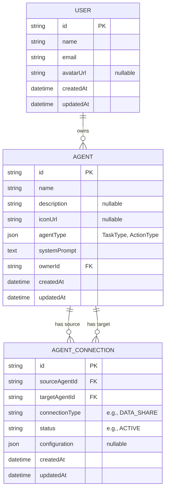
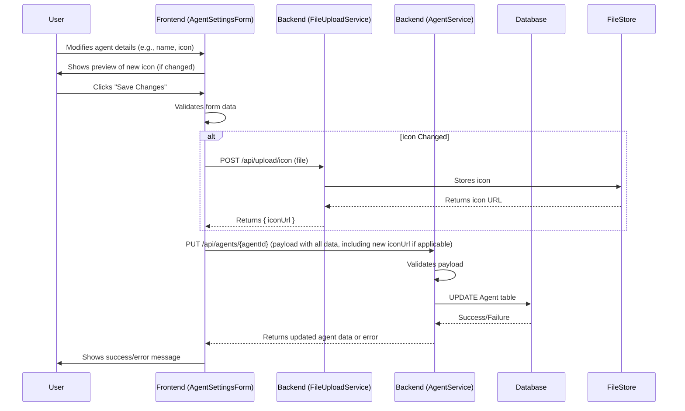
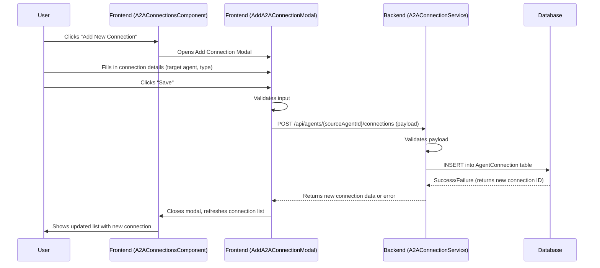

# Agent System Architecture

## 1. Introduction

This document outlines the system architecture for the enhanced Agent entity and associated UI modifications. It builds upon the requirements, domain model, and pseudocode provided in:

*   [`docs/01_agent_requirements.md`](docs/01_agent_requirements.md)
*   [`docs/02_agent_domain_model.md`](docs/02_agent_domain_model.md)
*   [`docs/03_agent_pseudocode.md`](docs/03_agent_pseudocode.md)

The architecture aims to be scalable, secure, and modular, with clear definitions of responsibilities across services, APIs, and components.

## 2. System Overview

The system comprises a Frontend Application (Next.js) interacting with a Backend API. The Backend API manages data persistence in a Database and handles business logic related to Agents, Agent-to-Agent (A2A) connections, and User settings.

```mermaid
graph TD
    User[End User] --> Browser[Web Browser];
    Browser --> FE[Frontend Application (Next.js)];
    FE -- HTTPS/API Calls --> BE[Backend API];
    BE --> DB[Database (e.g., PostgreSQL)];
    BE --> FileStore[File Storage (for Icons/Avatars)];

    subgraph Frontend Components
        direction LR
        AgentSettingsPage_UI[Agent Settings Page UI]
        AgentDetailPage_UI[Agent Detail Page UI]
        A2AConnections_UI[A2A Connections UI]
        UserSettingsPage_UI[User Settings Page UI]
    end

    subgraph Backend Services
        direction LR
        AgentService_BE[Agent Service]
        A2AConnectionService_BE[A2A Connection Service]
        UserService_BE[User Service]
        FileUploadService_BE[File Upload Service]
    end

    FE -- Uses --> AgentSettingsPage_UI;
    FE -- Uses --> AgentDetailPage_UI;
    FE -- Uses --> A2AConnections_UI;
    FE -- Uses --> UserSettingsPage_UI;

    AgentSettingsPage_UI -- Interacts via API --> AgentService_BE;
    AgentSettingsPage_UI -- Interacts via API --> FileUploadService_BE;
    AgentDetailPage_UI -- Interacts via API --> AgentService_BE;
    A2AConnections_UI -- Interacts via API --> A2AConnectionService_BE;
    UserSettingsPage_UI -- Interacts via API --> UserService_BE;
    UserSettingsPage_UI -- Interacts via API --> FileUploadService_BE;

    AgentService_BE -- CRUD --> DB;
    A2AConnectionService_BE -- CRUD --> DB;
    UserService_BE -- CRUD --> DB;
    FileUploadService_BE -- Manages Files --> FileStore;
```

## 3. Frontend Architecture

The frontend is a Next.js application utilizing React components for the UI.

### 3.1. Key Components

*   **`AgentSettingsForm` Component (`src/app/(dashboard)/agents/[agentId]/page.tsx` or dedicated component):**
    *   **Responsibilities:** Displays and manages the form for creating/editing agent properties including icon, name, description, agent type (task type, action type), and system prompt. Handles input validation and submission.
    *   **Interactions:** Fetches agent data (if editing), submits updated data to the Backend API (`AgentService`, `FileUploadService`).
*   **`AgentDetailPage` (`src/app/(dashboard)/agents/[agentId]/page.tsx`):**
    *   **Responsibilities:** Main page for an individual agent. Manages tab navigation between "Settings", "Task" (formerly "Trigger"), and the new "A2A" tab.
    *   **Interactions:** Fetches agent data. Renders child components based on the active tab.
*   **`A2AConnectionsComponent` (within `AgentDetailPage`'s "A2A" Tab):**
    *   **Responsibilities:** Displays a list of existing A2A connections for the current agent. Allows adding, editing (future), and removing connections.
    *   **Interactions:** Interacts with `A2AConnectionService` via API. May use modal dialogs (`AddA2AConnectionModal`, `EditA2AConnectionModal`) for managing individual connections.
*   **`UserSettingsPage` (`src/app/(dashboard)/setting/page.tsx`):**
    *   **Responsibilities:** Allows users to update their profile information, specifically their username and avatar. System prompt and appearance settings are removed from this page.
    *   **Interactions:** Fetches current user data, submits updates to `UserService` and `FileUploadService` via API.

### 3.2. State Management

*   Local component state (e.g., `useState`, `useReducer` in React) will be used for form data and UI states within components.
*   For shared state or more complex scenarios (e.g., caching fetched data), a global state management solution like Zustand, Jotai, or React Context API can be employed if not already in use. Server-side state can be managed with libraries like React Query or SWR for data fetching, caching, and synchronization.

### 3.3. UI Structure (Agent Detail Page)

```mermaid
graph TD
    ADP[Agent Detail Page] --> Tabs[Tab Container: Settings | Task | A2A];
    Tabs -- Settings Active --> ASF[AgentSettingsForm];
    Tabs -- Task Active --> TMC[TaskManagementComponent (Old Trigger Tab Content)];
    Tabs -- A2A Active --> A2ACC[A2AConnectionsComponent];
    A2ACC --> AddBtn[Add New Connection Button];
    A2ACC --> ConnList[List of Connections];
    ConnList --> ConnItem[Connection Item (View/Edit/Remove)];
    AddBtn -- Opens --> AddModal[AddA2AConnectionModal];
```

## 4. Backend Architecture

The backend will expose RESTful APIs to be consumed by the frontend.

### 4.1. Services

*   **Agent Service:**
    *   **Responsibilities:** Handles all CRUD operations for Agent entities. Manages the `agentType` (task type, action type) logic. Handles data validation and business rules related to agents.
    *   **Key Endpoints:**
        *   `POST /api/agents`: Create a new agent.
        *   `GET /api/agents/{agentId}`: Retrieve an agent.
        *   `PUT /api/agents/{agentId}`: Update an agent.
        *   `DELETE /api/agents/{agentId}`: Delete an agent.
        *   `GET /api/agents`: List agents (with pagination/filtering).
*   **A2A Connection Service:**
    *   **Responsibilities:** Manages CRUD operations for `AgentConnection` entities. Handles logic for establishing, modifying, and terminating connections between agents.
    *   **Key Endpoints:**
        *   `POST /api/agents/{agentId}/connections`: Create an A2A connection for an agent.
        *   `GET /api/agents/{agentId}/connections`: List A2A connections for an agent.
        *   `PUT /api/agents/{agentId}/connections/{connectionId}`: Update an A2A connection.
        *   `DELETE /api/agents/{agentId}/connections/{connectionId}`: Remove an A2A connection.
*   **User Service:**
    *   **Responsibilities:** Manages user profile information.
    *   **Key Endpoints:**
        *   `GET /api/users/me`: Get current user's profile.
        *   `PUT /api/users/me`: Update current user's profile (name, avatarUrl).
*   **File Upload Service:**
    *   **Responsibilities:** Handles uploads of agent icons and user avatars. Stores files in a designated storage (e.g., S3, local filesystem) and returns a URL or identifier for the uploaded file.
    *   **Key Endpoints:**
        *   `POST /api/upload/icon`: Upload an agent icon.
        *   `POST /api/upload/avatar`: Upload a user avatar.
    *   **Security:** Implement checks for file size, type, and potentially virus scanning.

### 4.2. API Design Principles

*   **RESTful:** Use standard HTTP methods (GET, POST, PUT, DELETE).
*   **JSON:** Use JSON for request and response payloads.
*   **Stateless:** Each API request should contain all necessary information.
*   **Versioning:** Consider API versioning (e.g., `/api/v1/...`) for future compatibility.
*   **Error Handling:** Use standard HTTP status codes for errors and provide clear error messages in responses.

## 5. Data Model

The data model is based on [`docs/02_agent_domain_model.md`](docs/02_agent_domain_model.md).



**Note on `AGENT.agentType`:**
The `agentType` field (containing `taskType` and `actionType`) will be stored as a JSON object within the `AGENT` table. This is suitable for many modern databases (like PostgreSQL's JSONB type) and simplifies the schema. If the database does not have good JSON support or if complex queries on `taskType`/`actionType` are frequent, these could be denormalized into separate columns.

## 6. Key Data Flows

### 6.1. Updating Agent Settings



### 6.2. Adding an A2A Connection



## 7. Security Considerations

*   **Authentication:** All API endpoints must be protected. Use a robust authentication mechanism (e.g., JWT, session cookies).
*   **Authorization:**
    *   Users should only be able to modify agents they own.
    *   Permissions for managing A2A connections need to be defined (e.g., only the source agent owner can create/delete).
*   **Input Validation:**
    *   **Client-Side:** Basic validation for better UX.
    *   **Server-Side:** Comprehensive validation is crucial to prevent invalid data and security vulnerabilities (e.g., XSS, SQLi). Validate all incoming data against expected types, lengths, formats, and allowed values (enums).
*   **File Uploads:**
    *   Validate file types, sizes.
    *   Sanitize filenames.
    *   Consider storing user-uploaded files in a separate, non-executable location or a dedicated cloud storage service.
    *   Scan for malware if possible.
*   **API Rate Limiting:** Protect against abuse.
*   **HTTPS:** Enforce HTTPS for all communication.
*   **Secrets Management:** No hardcoded secrets. Use environment variables or a secrets management service.

## 8. Scalability and Modularity

*   **Modularity:**
    *   **Frontend:** Component-based architecture (React) promotes modularity. Clear separation of concerns between UI components, state management, and API interaction logic.
    *   **Backend:** Service-oriented approach. Each service (Agent, A2A, User, FileUpload) has a distinct responsibility. This allows services to be developed, deployed, and scaled independently if needed in the future (e.g., as microservices, though a well-structured monolith is fine initially).
*   **Scalability:**
    *   **Backend:** Stateless API design allows for horizontal scaling by adding more instances of the backend application behind a load balancer.
    *   **Database:** Choose a database that can scale (e.g., PostgreSQL with read replicas, sharding capabilities for very large scale). Optimize queries and use indexing.
    *   **File Storage:** Using a cloud storage service (e.g., AWS S3, Google Cloud Storage) for icons/avatars provides inherent scalability for file storage and delivery.
    *   **Asynchronous Operations:** For potentially long-running tasks (e.g., complex agent actions if `actionType` involves them), consider using message queues and background workers, though this is out of scope for the current UI/entity changes.

## 9. Data Migration for Existing Agents

As per [`docs/01_agent_requirements.md#EC3.1.3`](docs/01_agent_requirements.md:45) and [`docs/02_agent_domain_model.md#4`](docs/02_agent_domain_model.md:111).
*   **Strategy:** A migration script will be needed to update existing `Agent` records in the database.
*   **Default Values:**
    *   `agentType.taskType`: Define a sensible default (e.g., `TASK_ORIENTED` or a new `GENERAL_ASSISTANCE` type if appropriate for legacy agents). This needs to be decided based on the most common current usage.
    *   `agentType.actionType`: If `taskType` defaults to something that requires an `actionType` (like `TASK_ORIENTED`), a default `actionType` should also be set (e.g., `API_CALL` or a new `UNDEFINED_ACTION`). Otherwise, it can be `null`.
*   **Process:**
    1.  Add the new `agentType` column (e.g., JSONB) to the `Agent` table.
    2.  Run a migration script to populate this column for all existing agents based on the chosen default values.
    3.  The application code should then be updated to read/write this new structure.
    4.  Users may need to be notified or guided to review and update the types for their existing agents if the defaults are not perfectly accurate.

## 10. User Settings Page Modifications

*   The `User` entity and corresponding database table will be updated to include `avatarUrl` (string, nullable).
*   Fields like `systemPrompt` and `appearanceSettings` (if they existed directly on the User model for the settings page) will be removed from the User entity/table if they are not general user properties. The `systemPrompt` is now an Agent-specific property.
*   The UI at [`src/app/(dashboard)/setting/page.tsx`](src/app/(dashboard)/setting/page.tsx) will be updated to reflect these changes:
    *   Allow avatar upload.
    *   Allow username change.
    *   Remove sections for system prompt and appearance settings.

This architecture provides a foundation for the required changes, emphasizing clear separation of concerns and defined interfaces.